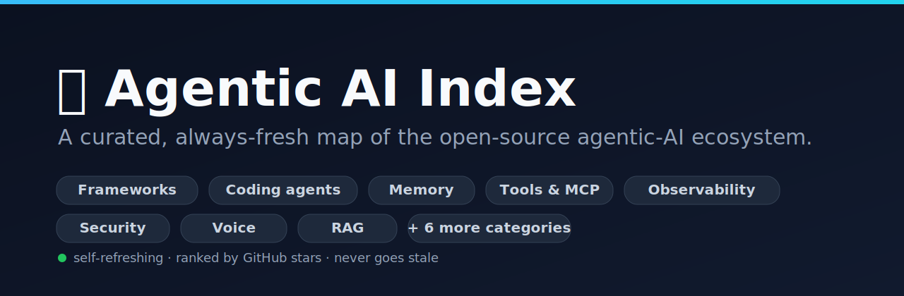

<div align="center">



# 🧭 Agentic AI Index

**A curated, always-fresh map of the open-source agentic-AI ecosystem.**

Frameworks · coding agents · memory · tools & MCP · observability · security · voice · RAG —
every entry live-ranked by GitHub stars and auto-refreshed, so the list never goes stale.

[](https://awesome.re)
[](scripts/generate.mjs)
[](LICENSE)
[](CONTRIBUTING.md)

</div>

---

**Why another list?** Most agentic-AI lists are hand-maintained and rot within months — the
largest one hasn't been updated since early 2025, with 800+ contributions stuck in its queue.
This one **regenerates itself**: humans decide *what* belongs and *where*; a script keeps every
star count, description, and dead link current. Curation is durable, metadata is automated.

- 🔄 **Never stale** — a scheduled job re-fetches every repo and reorders by momentum.
- 🗺️ **A map, not a dump** — organized by what each project *does*, not one flat wall of links.
- ✅ **No dead links** — archived and renamed/404'd repos are pruned or followed automatically.

<!-- AUTOGEN:START -->

> **63 projects** · **13 categories** · ranked by GitHub stars · auto-refreshed **2026-07-13**

**Contents**

- [Agent Frameworks & Orchestration](#agent-frameworks--orchestration) <sub>·&nbsp;14</sub>
- [Coding Agents](#coding-agents) <sub>·&nbsp;8</sub>
- [Browser & Computer Use](#browser--computer-use) <sub>·&nbsp;3</sub>
- [Memory & Context](#memory--context) <sub>·&nbsp;4</sub>
- [Tool Use & MCP](#tool-use--mcp) <sub>·&nbsp;3</sub>
- [LLM Infrastructure & Gateways](#llm-infrastructure--gateways) <sub>·&nbsp;6</sub>
- [Observability & Evaluation](#observability--evaluation) <sub>·&nbsp;6</sub>
- [Security & Guardrails](#security--guardrails) <sub>·&nbsp;2</sub>
- [Voice & Multimodal Agents](#voice--multimodal-agents) <sub>·&nbsp;3</sub>
- [Research Agents](#research-agents) <sub>·&nbsp;2</sub>
- [Platforms & Low-Code](#platforms--low-code) <sub>·&nbsp;6</sub>
- [RAG & Data](#rag--data) <sub>·&nbsp;3</sub>
- [Personal AI Assistants](#personal-ai-assistants) <sub>·&nbsp;3</sub>

### Agent Frameworks & Orchestration

_Build and coordinate agents — single-agent loops to multi-agent workflows._

- **[Significant-Gravitas/AutoGPT](https://github.com/Significant-Gravitas/AutoGPT)** `⭐ 185.5k · Python` — AutoGPT is the vision of accessible AI for everyone, to use and to build on. Our mission is to provide the tools, so that you can focus on what matters.
- **[FoundationAgents/MetaGPT](https://github.com/FoundationAgents/MetaGPT)** `⭐ 69.3k · Python` — 🌟 The Multi-Agent Framework: First AI Software Company, Towards Natural Language Programming
- **[ruvnet/ruflo](https://github.com/ruvnet/ruflo)** `⭐ 64.2k · TypeScript` — 🌊 The leading agent meta-harness. Deploy intelligent multi-player swarms, coordinate autonomous workflows, and build conversational AI systems. Features adaptive memory, self-learning intelligence, RAG integration, and native Claude Code / Codex / Hermes and many more Integrated
- **[microsoft/autogen](https://github.com/microsoft/autogen)** `⭐ 59.7k · Python` — A programming framework for agentic AI
- **[crewAIInc/crewAI](https://github.com/crewAIInc/crewAI)** `⭐ 55.4k · Python` — Framework for orchestrating role-playing, autonomous AI agents. By fostering collaborative intelligence, CrewAI empowers agents to work together seamlessly, tackling complex tasks.
- **[agno-agi/agno](https://github.com/agno-agi/agno)** `⭐ 41.1k · Python` — Build, run, and manage your own agent platform.
- **[langchain-ai/langgraph](https://github.com/langchain-ai/langgraph)** `⭐ 37.2k · Python` — Build resilient agents.
- **[openai/openai-agents-python](https://github.com/openai/openai-agents-python)** `⭐ 27.9k · Python` — A lightweight, powerful framework for multi-agent workflows
- **[agentscope-ai/agentscope](https://github.com/agentscope-ai/agentscope)** `⭐ 27.8k · Python` — Build and run agents you can see, understand and trust.
- **[google/adk-python](https://github.com/google/adk-python)** `⭐ 20.6k · Python` — An open-source, code-first Python toolkit for building, evaluating, and deploying sophisticated AI agents with flexibility and control.
- **[pydantic/pydantic-ai](https://github.com/pydantic/pydantic-ai)** `⭐ 18.5k · Python` — AI Agent Framework, the Pydantic way
- **[camel-ai/camel](https://github.com/camel-ai/camel)** `⭐ 17.4k · Python` — 🐫 CAMEL: The first and the best multi-agent framework. Finding the Scaling Law of Agents. https://www.camel-ai.org
- **[kyegomez/swarms](https://github.com/kyegomez/swarms)** `⭐ 6.9k · Python` — The Enterprise-Grade Production-Ready Multi-Agent Orchestration Framework. Website: https://swarms.ai
- **[strands-agents/harness-sdk](https://github.com/strands-agents/harness-sdk)** `⭐ 6.5k · Python` — Build an agent harness and control it end-to-end. Open-source SDK for production AI agents in Python & TypeScript - any model, any cloud.

### Coding Agents

_Agents that read, write, and ship code — terminals, IDEs, and CI._

- **[OpenHands/OpenHands](https://github.com/OpenHands/OpenHands)** `⭐ 80.6k · Python` — 🙌 OpenHands: AI-Driven Development
- **[cline/cline](https://github.com/cline/cline)** `⭐ 64.6k · TypeScript` — Autonomous coding agent as an SDK, IDE extension, or CLI assistant.
- **[aaif-goose/goose](https://github.com/aaif-goose/goose)** `⭐ 51.1k · Rust` — an open source, extensible AI agent that goes beyond code suggestions - install, execute, edit, and test with any LLM
- **[Aider-AI/aider](https://github.com/Aider-AI/aider)** `⭐ 47.3k · Python` — aider is AI pair programming in your terminal
- **[continuedev/continue](https://github.com/continuedev/continue)** `⭐ 34.8k · TypeScript` — open-source coding agent
- **[oraios/serena](https://github.com/oraios/serena)** `⭐ 26.4k · Python` — A powerful MCP toolkit for coding, providing semantic retrieval and editing capabilities - the IDE for your agent
- **[SWE-agent/SWE-agent](https://github.com/SWE-agent/SWE-agent)** `⭐ 19.8k · Python` — SWE-agent takes a GitHub issue and tries to automatically fix it, using your LM of choice. It can also be employed for offensive cybersecurity or competitive coding challenges. [NeurIPS 2024]
- **[gptme/gptme](https://github.com/gptme/gptme)** `⭐ 4.4k · Python` — Your agent in your terminal, equipped with local tools: writes code, uses the terminal, browses the web. Make your own persistent autonomous agent on top!

### Browser & Computer Use

_Agents that drive a browser, a desktop, or a sandbox._

- **[browser-use/browser-use](https://github.com/browser-use/browser-use)** `⭐ 104.5k · Python` — 🌐 Make websites accessible for AI agents. Automate tasks online with ease.
- **[microsoft/playwright-mcp](https://github.com/microsoft/playwright-mcp)** `⭐ 35k · TypeScript` — Playwright MCP server
- **[e2b-dev/E2B](https://github.com/e2b-dev/E2B)** `⭐ 13k · Python` — Open-source, secure environment with real-world tools for enterprise-grade agents.

### Memory & Context

_Long-term memory, state, and context management for agents._

- **[thedotmack/claude-mem](https://github.com/thedotmack/claude-mem)** `⭐ 87k · JavaScript` — Persistent Context Across Sessions for Every Agent – Captures everything your agent does during sessions, compresses it with AI, and injects relevant context back into future sessions. Works with Claude Code, OpenClaw, Codex, Gemini, Hermes, Copilot, OpenCode + More
- **[mem0ai/mem0](https://github.com/mem0ai/mem0)** `⭐ 60.7k · TypeScript` — Universal memory layer for AI Agents
- **[topoteretes/cognee](https://github.com/topoteretes/cognee)** `⭐ 27.7k · Python` — Cognee is the open-source AI memory platform for agents. Give your AI agents persistent long-term memory across sessions with a self-hosted knowledge graph engine.
- **[letta-ai/letta](https://github.com/letta-ai/letta)** `⭐ 23.8k · Python` — Platform for stateful agents: AI with advanced memory that can learn and self-improve over time.

### Tool Use & MCP

_Tool-calling platforms and the Model Context Protocol ecosystem._

- **[modelcontextprotocol/servers](https://github.com/modelcontextprotocol/servers)** `⭐ 88.4k · TypeScript` — Model Context Protocol Servers
- **[upstash/context7](https://github.com/upstash/context7)** `⭐ 59k · TypeScript` — Context7 Platform -- Up-to-date code documentation for LLMs and AI code editors
- **[aipotheosis-labs/aci](https://github.com/aipotheosis-labs/aci)** `⭐ 4.8k · Python` — ACI.dev is the open source tool-calling platform that hooks up 600+ tools into any agentic IDE or custom AI agent through direct function calling or a unified MCP server. The birthplace of VibeOps.

### LLM Infrastructure & Gateways

_The plumbing agents run on — gateways, routers, runtimes, and programming layers._

- **[ollama/ollama](https://github.com/ollama/ollama)** `⭐ 176k · Go` — Get up and running with Kimi-K2.6, GLM-5.1, MiniMax, DeepSeek, gpt-oss, Qwen, Gemma and other models.
- **[langchain-ai/langchain](https://github.com/langchain-ai/langchain)** `⭐ 141.7k · Python` — The agent engineering platform.
- **[BerriAI/litellm](https://github.com/BerriAI/litellm)** `⭐ 53.4k · Python` — Python SDK, Proxy Server (AI Gateway) to call 100+ LLM APIs in OpenAI (or native) format, with cost tracking, guardrails, loadbalancing and logging. [Bedrock, Azure, OpenAI, VertexAI, Cohere, Anthropic, Sagemaker, HuggingFace, VLLM, NVIDIA NIM]
- **[run-llama/llama_index](https://github.com/run-llama/llama_index)** `⭐ 50.8k · Python` — LlamaIndex is the leading document agent and OCR platform
- **[stanfordnlp/dspy](https://github.com/stanfordnlp/dspy)** `⭐ 36.1k · Python` — DSPy: The framework for programming—not prompting—language models
- **[Mirascope/mirascope](https://github.com/Mirascope/mirascope)** `⭐ 1.5k · Python` — The LLM Anti-Framework

### Observability & Evaluation

_Trace, measure, and evaluate agents in development and production._

- **[langfuse/langfuse](https://github.com/langfuse/langfuse)** `⭐ 31k · TypeScript` — 🪢 Open source AI engineering platform: LLM evals, observability, metrics, prompt management, playground, datasets. Integrates with OpenTelemetry, LangChain, OpenAI SDK, LiteLLM, and more. 🍊YC W23
- **[promptfoo/promptfoo](https://github.com/promptfoo/promptfoo)** `⭐ 23.2k · TypeScript` — Test your prompts, agents, and RAGs. Red teaming/pentesting/vulnerability scanning for AI. Compare performance of GPT, Claude, Gemini, DeepSeek, and more. Simple declarative configs with command line and CI/CD integration. Used by OpenAI and Anthropic.
- **[confident-ai/deepeval](https://github.com/confident-ai/deepeval)** `⭐ 16.8k · Python` — The LLM Evaluation Framework
- **[Arize-ai/phoenix](https://github.com/Arize-ai/phoenix)** `⭐ 10.5k · Python` — AI Observability & Evaluation
- **[traceloop/openllmetry](https://github.com/traceloop/openllmetry)** `⭐ 7.3k · Python` — Open-source observability for your GenAI or LLM application, based on OpenTelemetry
- **[openlit/openlit](https://github.com/openlit/openlit)** `⭐ 2.6k · TypeScript` — Open source platform for AI Engineering: OpenTelemetry-native LLM Observability, GPU Monitoring, Guardrails, Evaluations, Prompt Management, Vault, Playground. 🚀💻 Integrates with 50+ LLM Providers, VectorDBs, Agent Frameworks and GPUs.

### Security & Guardrails

_Guardrails, input/output filtering, and agent security._

- **[guardrails-ai/guardrails](https://github.com/guardrails-ai/guardrails)** `⭐ 7.1k · Python` — Adding guardrails to large language models.
- **[NVIDIA-NeMo/Guardrails](https://github.com/NVIDIA-NeMo/Guardrails)** `⭐ 6.7k · Python` — NeMo Guardrails is an open-source toolkit for easily adding programmable guardrails to LLM-based conversational systems.

### Voice & Multimodal Agents

_Real-time voice, vision, and multimodal agent frameworks._

- **[pipecat-ai/pipecat](https://github.com/pipecat-ai/pipecat)** `⭐ 13.4k · Python` — Open Source framework for voice and multimodal conversational AI
- **[livekit/agents](https://github.com/livekit/agents)** `⭐ 11.3k · Python` — A framework for building realtime voice AI agents 🤖🎙️📹
- **[TEN-framework/ten-framework](https://github.com/TEN-framework/ten-framework)** `⭐ 10.9k · Python` — Open-source framework for conversational voice AI agents

### Research Agents

_Autonomous research and long-horizon information-gathering agents._

- **[bytedance/deer-flow](https://github.com/bytedance/deer-flow)** `⭐ 76.9k · Python` — An open-source long-horizon SuperAgent harness that researches, codes, and creates. With the help of sandboxes, memories, tools, skill, subagents and message gateway, it handles different levels of tasks that could take minutes to hours.
- **[assafelovic/gpt-researcher](https://github.com/assafelovic/gpt-researcher)** `⭐ 28.3k · Python` — An autonomous agent that conducts deep research on any data using any LLM providers

### Platforms & Low-Code

_Visual builders and platforms for shipping agentic apps._

- **[n8n-io/n8n](https://github.com/n8n-io/n8n)** `⭐ 196.2k · TypeScript` — Fair-code workflow automation platform with native AI capabilities. Combine visual building with custom code, self-host or cloud, 400+ integrations.
- **[langgenius/dify](https://github.com/langgenius/dify)** `⭐ 148.7k · TypeScript` — Production-ready platform for agentic workflow development.
- **[open-webui/open-webui](https://github.com/open-webui/open-webui)** `⭐ 145.2k · Python` — User-friendly AI Interface (Supports Ollama, OpenAI API, ...)
- **[lobehub/lobehub](https://github.com/lobehub/lobehub)** `⭐ 79.8k · TypeScript` — 🤯 LobeHub is your Chief Agent Operator, organizing your agents into 7×24 operations by hiring, scheduling, and reporting on your entire AI team.
- **[Mintplex-Labs/anything-llm](https://github.com/Mintplex-Labs/anything-llm)** `⭐ 63.2k · JavaScript` — Stop renting your intelligence. Own it with AnythingLLM. Everything you need for a powerful local-first agent experience
- **[FlowiseAI/Flowise](https://github.com/FlowiseAI/Flowise)** `⭐ 54.6k · TypeScript` — Build AI Agents, Visually

### RAG & Data

_Retrieval, scraping, and data pipelines that feed agents._

- **[firecrawl/firecrawl](https://github.com/firecrawl/firecrawl)** `⭐ 150.1k · TypeScript` — The API to search, scrape, and interact with the web at scale. 🔥
- **[infiniflow/ragflow](https://github.com/infiniflow/ragflow)** `⭐ 84.9k · Go` — RAGFlow is a leading open-source Retrieval-Augmented Generation (RAG) engine that fuses cutting-edge RAG with Agent capabilities to create a superior context layer for LLMs
- **[unclecode/crawl4ai](https://github.com/unclecode/crawl4ai)** `⭐ 72.5k · Python` — 🚀🤖 Crawl4AI: Open-source LLM Friendly Web Crawler & Scraper. Don't be shy, join here: https://discord.gg/jP8KfhDhyN

### Personal AI Assistants

_General-purpose personal assistants you run yourself._

- **[openclaw/openclaw](https://github.com/openclaw/openclaw)** `⭐ 382.8k · TypeScript` — Your own personal AI assistant. Any OS. Any Platform. The lobster way. 🦞
- **[NousResearch/hermes-agent](https://github.com/NousResearch/hermes-agent)** `⭐ 214k · Python` — The agent that grows with you
- **[JuliusBrussee/caveman](https://github.com/JuliusBrussee/caveman)** `⭐ 88.8k · JavaScript` — 🪨 why use many token when few token do trick — Claude Code skill that cuts 65% of tokens by talking like caveman

<!-- AUTOGEN:END -->

---

## Contributing

Found something missing or miscategorized? **Don't hand-edit the list above — it's generated.**
Add one line to [`data/entries.json`](data/entries.json) and open a PR. Full guide in
[CONTRIBUTING.md](CONTRIBUTING.md).

```jsonc
{ "repo": "owner/name", "category": "Coding Agents" }
```

## How it stays fresh

[`scripts/generate.mjs`](scripts/generate.mjs) reads the curated seed, fetches live metadata
from the GitHub API, prunes archived/missing repos, sorts each category by stars, and rewrites
the block between the `AUTOGEN` markers. A [GitHub Action](.github/workflows/refresh.yml) runs it
on a schedule and commits any changes — no human in the loop for upkeep.

```bash
node scripts/generate.mjs          # regenerate README.md
node scripts/generate.mjs --check  # verify the list is in sync (maintainer convenience)
node scripts/discover.mjs          # refresh data/candidates.json (new repos to consider)
```

## Scope

Open-source (or source-available), self-hostable projects that build, run, orchestrate, observe,
secure, or extend **AI agents**. Inclusion is about usefulness to people building agents, not just
star count — but we rank by stars so the most-adopted work surfaces first.

## License

[CC0-1.0](LICENSE) — public domain. Copy, remix, and reuse freely.
